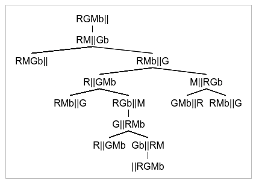

# Recurso 2018

## Exercício 1

### a)

1. RGMb ||
2. || RGMb
3. RM || Gb
4. Gb || RM
5. RMb || G
6. G || RMb
7. M || RGb
8. RGb || M
9. GMb || R
10. R || GMb

(Todos estes casos são os casos possíveis e seus inversos)

### b)

Número de "coisas" na margem inicial do rio. "coisas" in [R, G, M]

RGMb || , 3
RM || Gb, 2
|| RGMb, 0

### c)

## 2

### a)

M1 - 10 + 7 + 8 = 25

M2 - 11 + 12 = 23

Custo = 25

### b)

Sucessores:
1. A-M2, B-M1, C-M2, D-M2, E-M1 = 33
2. A-M1, B-M3, C-M2, D-M2, E-M1 = 18
3. A-M1, B-M1, C-M3, D-M2, E-M1 = 25
4. A-M1, B-M1, C-M2, D-M3, E-M1 = 25
5. A-M1, B-M1, C-M2, D-M2, E-M2 = 31
6. A-M1, B-M1, C-M2, D-M2, E-M3 = 23

Com a variante "steepest accent" do algoritmo "hill-climbing" o sucessor escolhido seria S2 = {A-M1, B-M3, C-M2, D-M2, E-M1} porque tem o menor custo entre todos os sucessores e é menor que o atual.

### c)

1. Delta = 25-33 = -8, T = 10, probabilty = e^(-8/10) = 0.45, como probability (0.45) < random (0.55) é rejeitado
2. Delta = 25-18 = 7, T = 10, como Delta > 0, é aceite.

## 4

### a)

O método de pesquisa sistemática melhor para este caso seria a pesquisa em profundidade em que o limite de profundidade seria a profunidade máxima. Como existem várias soluções existe uma grande probabilidade de ter de expandir poucas sub-árvores até encontrar uma solução. Sabendo que as soluções estão todas à mesma profundidade a solução encontrada seria sempre uma solução ótima, pois as outras soluções possíveis teriam a mesma profundidade.

### b)

- h - 110%
- x - 100%

* x = h*0.909

Assim, a melhor função heurística admissível com base em h seria 0.909h.

### d)

denominador = 10+15+27+30 = 82

1. P = 10/82 = 0.122
2. P = 15/82 = 0.183
3. P = 27/82 = 0.329
4. P = 30/92 = 0.366

### e)

Nós cortados:
- 9 e 1, porque 2 < 3.
- 7 porque 2 < 3.

### f)

Como o agente tem conhecimento completo do ambiente conseguimos saber a cause de cada perceção e, por isso, as regras são causais.

