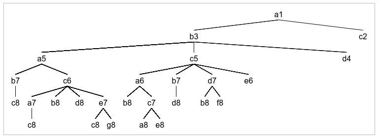
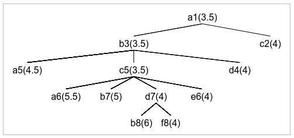

# Exame 2017

## Exercício 1

### a)

*Espero não me ter escapado nenhum nó pelo meio*

### b)

A pesquisa em largura encontra sempre uma solução pois, mesmo que haja ciclos, como este algoritmo vê uma expansão de um nó de cada vez não fica 'preso' num desses ciclos.

O métodos de pesquisa A* também é completo uma vez que, utilizando uma heurística admissível, mesmo que exista um ciclo o custo desses movimentos vai aumentando a cada jogada e, por isso, a partir de algum ponto o algoritmo vai deixar de expandir esse ramo da árvore e passar para outro.

pesquisa em profundidade e greedy-search não são  ótimos porque podem ficar presos em ciclos e não encontrar uma solução

### c)

- h1: Não é admissível, por exemplo, de d4 para c6 o custo é 1 e a heurística dá 3
- h2: Não é admissível, por exemplo, de d4 para c6 o custo é 1 e a heurística dá 2
- h3: É admissível, o cavalo desloca-se, no máximo, 2 posições numa direção por jogada, ou seja, o custo é, no máximo 1/2 por cada posição numa direção, que é o equivalente a esta heurística.
- h4: Não é admissível, por exemplo, de a1 para f8 a heurísticatem valor 5 e a menor jogada tem custo 4
- h5: É admissível pois é sempre menor ou igual à h3 e a heurística h3 é admissível.

Entre a h3 e a h5 a melhor é a h3 pois, em todos os casos, dá um resultado maior ou igual e, por isso, está mais próximo do valor real.

### d)

## Exercício 2

### a)

A = 00 V = 01 B = 10

I1: 10 01 10 00 01

### b)

Número de fronteiras = (P1-P2, P1-P3, P2-P3, P2-P4, P2-P5, P3-P4, P4-P5) = 7

Função de adaptação = 7 - número de fronteiras com cores iguais

- I1: 7 - 2 = 5
- I2: 7 - 1 = 6
- I3: 7 - 3 = 4
- I4: 7 - 5 = 2
- I5: 7 - 2 = 5

### c)

Probabilidade de escolha:
- I1: 5/22 = 0.227
- I2: 6/22 = 0.273
- I3: 4/22 = 0.182
- I4: 2/22 = 0.091
- I5: 5/22 = 0.227

Escolha:
- I1: 0.227 < 0.7, não é escolhido
- I2: 0.273 < 0.35, não é escolhido
- I3: 0.182 > 0.15, é escolhido
- I4: não é escolhido
- I5: não é escolhido

O indivíduo selecionado foi o indíviduo I3

### d)

Cruzamento em que se cruzam as cores dos últimos 2 países

Pelas probabilidades existem cruzamentos na 2ª e 3ª possibilidades, ou seja, entre o 2º e o 4º indivíduo (o 3º é o escolhido por isso não pode ser mutado).

|Indivíduo|Inicial|Cruzamento|Mutação|
|-|-|-|-|
|I1|10 01 10 - 00 01|10 01 10 - 00 01|10 01 10 - 0 01|
|I2|00 01 01 - 00 10|00 01 01 - **10 01**|00 01 **0**1 - 10 01|
|I3|10 01 00 - 01 01|10 01 00 - 01 01|10 01 00 - 01 01|
|I4|10 10 10 - 10 01|10 10 10 - 10 01|10 10 10 - 10 01|
|I5|10 10 01 - 10 01|10 10 01 - **00 10**|10 10 01 - 00 10|

Como a mutação geraria uma cor inválida não ocorre mutação.

## Exerício 4

### a)

O custo de um determinado nó deve ser a soma do custo de todas as arestas que ligam o nó inicial a esse nó.

### c)

A probabilidade de escolha de um estado sucessor diminui com o aumento da diferença de valores entre o estado atual e esse estado, e aumenta com o aumento da temperatura

### d)

Esta redução do número de nós acontece quando o nó que vai ser escolhido é o primeiro nó a ser avaliado e o primeiro nó avaliado em cada sub-árvore é pior do que o escolhido.

### e)

Para utilizar a fórmula "Naïve Bayes" é preciso que os estados do problema sejam independentes uns dos outros.
