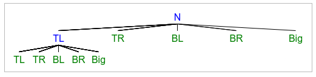

# Exame 2020

## Exercício 1

### 1.1)

- **Representação do estado**:
  - Uma matriz com 3 linhas e 3 colunas.
  - Cada elemento da matriz tem true caso seja uma peça branca e false caso seja uma peça vermelha.
- **Estado inicial**:
  - [ [false, true, false], [false, true, false], [true, true, true] ]
- **Teste objetivo**:
  - Todos os elementos são true.
  - [ [true, true, true], [true, true, true], [true, true, true] ]
- **Operadores**
  - **TL** - Quadrado pequeno em cima na esquerda
    - Pré-condições: Nenhuma
    - Efeitos:
      - M[0][0] = !M[0][0]
      - M[0][1] = !M[0][1]
      - M[1][0] = !M[1][0]
      - M[1][1] = !M[1][1]
    - Custo: 4
  - **TR** - Quadrado pequeno em cima na direita
    - Pré-condições: Nenhuma
    - Efeitos:
      - M[0][1] = !M[0][1]
      - M[0][2] = !M[0][2]
      - M[1][1] = !M[1][1]
      - M[1][2] = !M[1][2]
    - Custo: 4
  - **BL** - Quadrado pequeno em baixo na esquerda
    - Pré-condições: Nenhuma
    - Efeitos:
      - M[1][0] = !M[1][0]
      - M[1][1] = !M[1][1]
      - M[2][0] = !M[2][0]
      - M[2][1] = !M[2][1]
    - Custo: 4
  - **BR** - Quadrado pequeno em baixo na direita
    - Pré-condições: Nenhuma
    - Efeitos:
      - M[1][1] = !M[1][1]
      - M[1][2] = !M[1][2]
      - M[2][1] = !M[2][1]
      - M[2][2] = !M[2][2]
    - Custo: 4
  - **Big** - Quadrado grande
    - Pré-condições: Nenhuma
    - Efeitos:
      - M[0][0] = !M[0][0]
      - M[0][1] = !M[0][1]
      - M[0][2] = !M[0][2]
      - M[1][0] = !M[1][0]
      - M[1][1] = !M[1][1]
      - M[1][2] = !M[1][2]
      - M[2][0] = !M[2][0]
      - M[2][1] = !M[2][1]
      - M[2][2] = !M[2][2]
    - Custo: 9
- **Função de custo**:
  - Soma do custo de todas as jogadas feitas

### 1.2)

O fator de ramificação médio é 5, pois existem 5 possibilidades de jogadas em qualquer momento e nenhuma delas tem pré-condições.

Como cada elemento do tabuleiro tem 2 possibilidades e são independentes entre eles, o espaço de estados tem 2⁹=512 estados possíveis.

### 1.3)

A árvore é demasiado grande para representar em md, por isso, a minha árvore apenas tem o nome da jogada executada.

Pesquisa em largura:



Pesquisa em profundidade limitada:


Como no enunciado diz que os filhos são todos gerados imediatamente, na pesquisa em profundidade não é necessário expandir o TL TL, pois a solução já foi gerada.

### 1.4)

Uma heurística admissível seria o número de peças vermelhas no tabuleiro. Esta heurística é admissível porque o custo de cada jogada é o número de peças que são voltadas e, por isso, o custo real para chegar ao estado final é sempre maior ou igual ao número de peças que não sejam brancas.

```
function h:
	result = 0
	for column in matrix:
		for row in column:
			if (matrix[column][row] == false):
				result++
	return result
```

## Exercício 3

### 10

a)

- B = min(2, >=2, 8) = 2
- C = min(10, >=20) = 10
- D = min(5, ?) <= 5
- A = max(2, 10, <=5) = 10

b)

O, U, X, Y

### 11

O algoritmo minimax pode retornar rapidamente soluções imperfeitas ao chegar a uma profundidade limite. Estas soluções são imperfeitas porque nem sempre se chega a um estado de vitória. Por outro lado, podemos para o algoritmo após um limite de tempo e, retornar a melhor jogada que foi avaliada até ao momento.

### 13

Sim, no Mundo de Wumpus o número de jogadas é limitado e é possível resolver o problema apenas com a perceção atual do mundo.

### 1