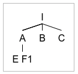
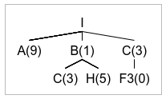
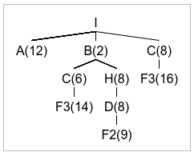

# Recurso 2 2018

## Exercício 1

### a)

i) Pesquisa em largura



Solução = F1

ii)



Solução = F3

iii)



Solução = F2

### b)

A heurística é admissível pois não existe nenhum nó cujo custo real seja menor do que o custo da heurística desse nó.

### c)

O algoritmo de pesquisa em largura pode encontrar uma solução que esteja num nível mais acima na árvore mas que pode ser dispendiosa do que uma solução que estivesse num nível mais baixo. Não é ótimo.

O algoritmo de pesquisa gulosa está depentente apenas da heurística utilizada e, por isso, pode encontrar uma solução que tem um custo maior, principalmente se a heurística utilizada não for boa. Não é ótimo.

O algoritmo A*, assumindo uma heurística admissível, vai sempre na direção do menor custo possível, uma vez que, expande sempre primeiro os nós com a soma do custo e heurística menor, pelo que, num só avalia um nó final quando o custo total deste nó for menor que a soma custo com heurística de todos os outros nós. É um algoritmo ótimo.

## Exercício 2

### a)

Carvalho: 00 Pinheiro: 01 Eucalipto: 10

i) 10 01 10 00 10

### b)

```
Contexto:
	Função de adaptação é uma função que transforma um problema de minimização num problema de maximização.
	Em vez do objetivo ser ter o menor custo, o objetivo passa a ser estar o mais próximo do custo máximo
```

Custo máximo = 10 * (20+10+10+20+10) = 700

Função de adaptação = 700 - custo da plantação

### c)

Função de adaptação:
- i) 700 - 20 * 8 - 10 * 9 - 10 * 8 - 20 * 10 - 10 * 8 = 90
- ii) 700 - 20 * 8 - 10 * 9 - 10 * 8 - 20 * 9 - 10 * 8 = 110
- iii) 700 - 20 * 9 - 10 * 8 - 10 * 10 - 20 * 8 - 10 * 10 = 80
- iv) 700 - 20 * 10 - 10 * 9 - 10 * 8 - 20 * 9 - 10 * 8 = 70

Probabilidades de escolha:
- i) 90/350 = 0.257 - ]0.314, 0.571]
- ii) 110/350 = 0.314 - ]0,0.314]
- iii) 80/350 = 0.229 - ]0,571, 0.8]
- iv) 70/350 = 0.2 ]0.8, 1]

Escolha:
- ii) escolhido por elitismo
- 0.22 in ]0, 0.314], ii) é escolhido
- 0.4 in ]0.314, 0.571] i) é escolhido
- 0.88 in ]0.8, 1] iv) é escolhido


### d)

Fazer crossover pelas 3 útlimas zonas.

- ii) mantém-se por elitismo
- ii) 0.55 < 0.75, logo cruza
- i) 0.87 > 0.75, logo mantém
- iv) 0.25 < 0.75, logo cruza

2ª geração:
|Indivíduo|Inicial|Cruzamento|Mutação|
|-|-|-|-|
|ii |10 01 10 - 01 10|10 01 10 - 01 10|10 01 10 - 01 10|
|ii |10 01 10 - 01 10|10 01 10 - **01 10**|10 01 10 - **0**1 10|
|i  |10 01 10 - 00 10|01 10 00 - 00 10|10 01 00 - 00 10|
|iv |00 01 10 - 01 10|00 01 10 - **01 10**|00 01 10 - 00 10|

Não ocorre mutação porque o valor 11 não corresponde a nenhum tipo de árvore.

## Exercício 4

### a)

A afirmação é false, pois num caso em que exista uma solução na metade esquerda da árvore e esse solução esteja num nível mais profundo do que uma solução na árvore da direita a pesquisa *primeiro em largura* dá a solução do lado esquerdo da árvore e a pesquisa *aprofundamento progressivo* dá a solução do lado direito da árvore.

### b)

No algoritmo *arrefecimento simulado* existe sempre uma hipótese de escolher uma opção que está mais longe da solução. Esta hipótese é tão maior quanto maior for a temperatura utilizada e, a temperatura diminui constantemente com a pesquisa de novas soluções. Por isso, no ínicio da pesquisa é mais provavél considerar uma solução que está mais longe da solução.

### c)

E -> max(2,3) = 3
F -> max(5,?)>= 5
B -> min(3,>=5) = 3

Houve um corte no nó F pois o 5 é maior que 3

G -> max(0) = 0
C -> min(0,?) <= 0

Houve um corte no nó C pois o 0 é menor que o 3 do nó B

I -> max(2,1) = 2
D -> min(2,?) <= 2

Houve um corte no nó D pois o 2 é menor que o 3 do nó B


